## Testing Strategies 
## (not only) 
## for JavaScript

Note: Hi all, thanx for having me here. My name is Christian Hörauf and I work as a developer for Consorsbank in Nürnberg. Last year I gave Santa Clause for the children of our friends. And you know St Clauses Business. Providing pesents for children. But his unique selling point is this incredibly tough time schedule to visit all children in one night. You know this event, when everybody sets up Trees in their rooms and meets their families and stuff - X-Mess. And in that same night when I played St Clause, I had the dream that lead elves of computer game develoment was talking to me. And this is what he said:

Hey Santa, we need to talk about our flow of production. I understand that for you it is most important that we create presents, presents, presents. But I you know, that we do not have the progress you expected and maybe we can invest a little bit more time in our development process. I would love to provide you some ideas: 

??VERTICAL
## Motivation

Note: First of all, can you remember last year, when we were so far behind the schedule, that you was afraid that you could not deliver all ordered presents in time and people might loose faith in you? May I remind you of your awful nightmares you had at that time. You woke up every night and mumbled something about Easter Bunnies ruling the earth...
Can you remember the hussles we had back then? 

??VERTICAL
### No Trust in our quality measures
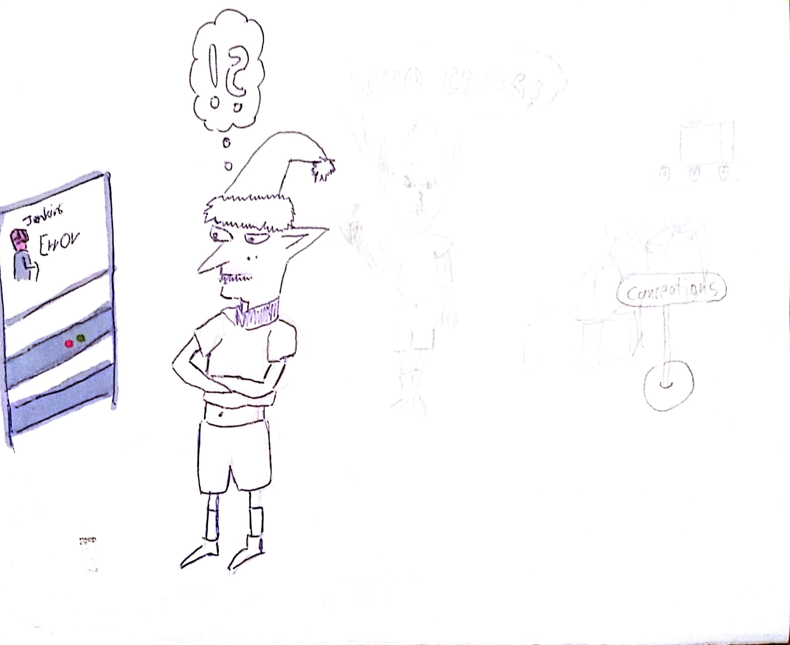
Note: We had no trust in our measures. When we saw an error, it did not matter.

??VERTICAL
### When something happened eac h elve tried to accuse someother elve

Note: Instead we prefered to accuse everybody else that they introduced the error.

??VERTICAL
### Since no one was accusable, nobody cared
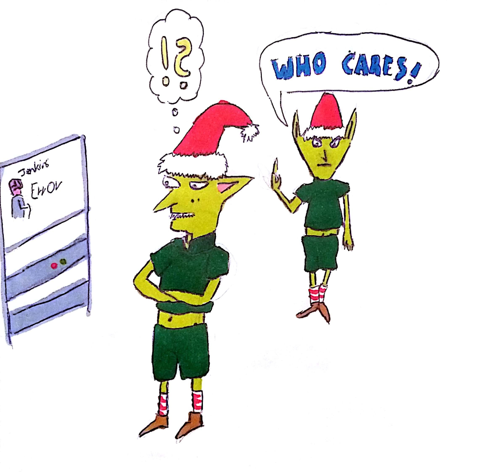
Note: But very soon, who ever was interested in good quality gave up on it, because any quality measure they took, very soon had been turned of by others who did not trust in the quality measure and turned them of, just to assure the release date and not beeing "slowed down". 

??VERTICAL
### People send back presents
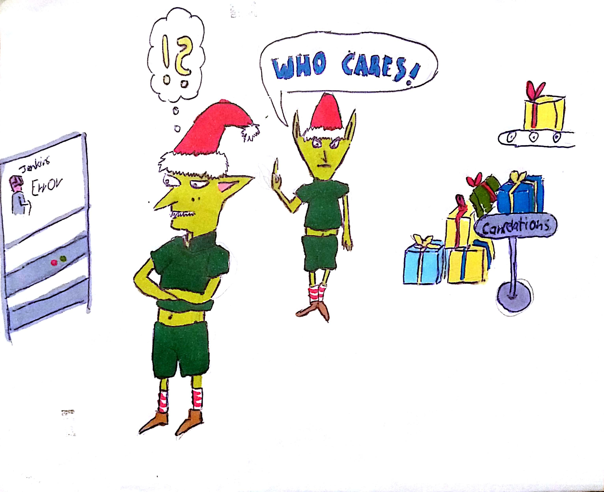
Note: But they ignored the fact, that they would loose much more time when people send back their presents due to some failures and they need to fix them.

??VERTICAL
### Broken-Window-Theory

Note: 
Did you ever heard of the Broken-Window-Theory? It predicts that if you do not care about all windows in a house and one is broken, soon somebody will say: Nobody takes care of it, so why not try to hit another window just for fun. I will not be accused anyhow.
And this was exactly what happened to our quality measures. 

??VERTICAL
### Testing decay

* If you do not trust in them, you do not take care of them. <!-- .element: class="fragment" -->
* If you do not take care of them, they will become worthless. <!-- .element: class="fragment" -->
* And you will be left with a bulk of unmaintainable code, as always... <!-- .element: class="fragment" -->

??VERTICAL
### Testing Pyramid

Note: Do you remember that we than took advice from this IT-Guy - Martin Fowler? He put up the model of the test pyramid. Since it is easiest and cheapest to write Unittests, he claims that you should create your test harness by a solid foundation of unit tests. Test the interaction of multiple Systems by some integration tests and only the happy path of the application by a few End-to-End-Tests. 


??VERTICAL
## TDD
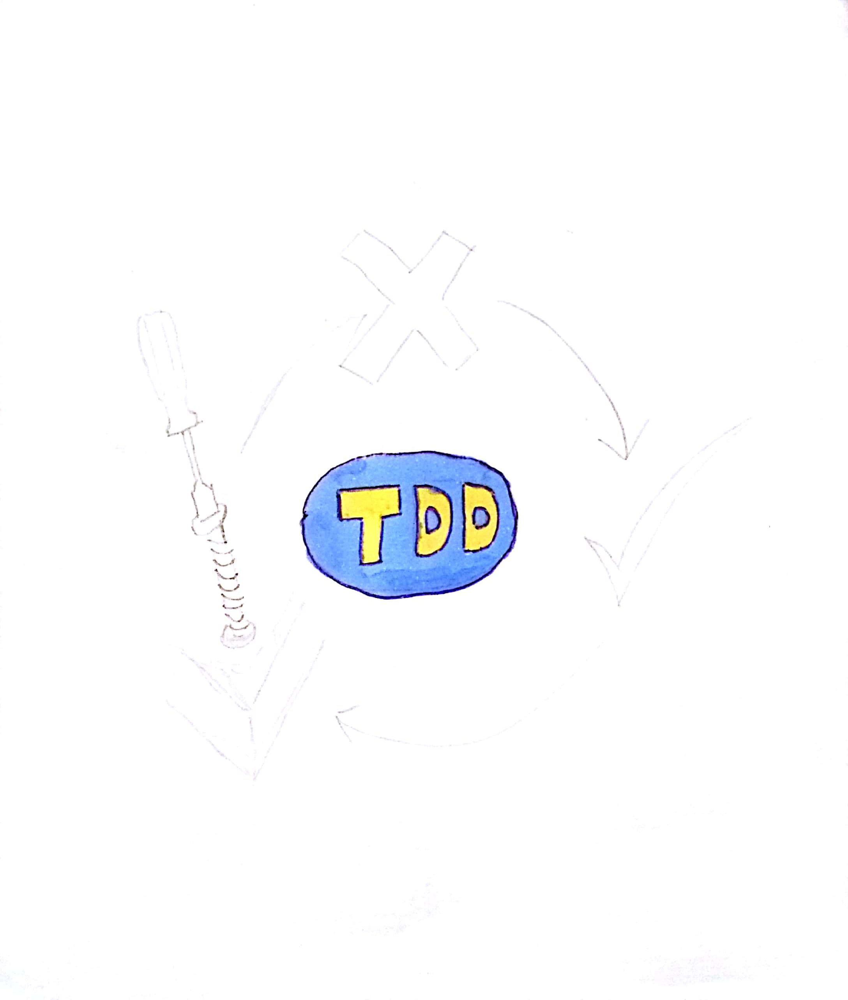
Note: Back then we wondered how we could come to this solid foundation of unit tests. Is there some guidance that leads you to this solid foundation of unit tests? What is the easiest way to reach it? 

Do you remember that we applied Test-Driven-Development to reach this state? Yes it was hard time to convice my co elves to learn and apply this technique. I had to explain them how we spend our days without TDD and how it changed like Michael Hill explained it.

??VERTICAL
### Programm (classic)

Note: When you write Software, of course you spent some time programming. This is the best part of the day when you can be creative and think about what the Software might need and you acutally write code.

??VERTICAL
### Study (classic)

Note: But you also have to study code, to find the right place where to introduce features and find out how the system concretely works.

??VERTICAL
### Geek at Keyboard (classic)

Note: But the majority of time we spent stepping through code by debugging. We debug to find out how the software currently works. We debug to test if our code changes work properly maybe several times. We click dozens of times through our app to bring the app into the state where the bug has to be fixed or the feature has to be implemented. This is such a waste of time.

Let's have a look how this time spending changed after we applied TDD

??VERTICAL
### Programm (TDD)

Note: So one of the issues the other elves had became true: Yes we spent about double of time for Programming (from which I said it is the best part of the day), because besides the production code we also have to write tests. BUT ...

??VERTICAL
### Studying (TDD)

Note: Already the studying took less time, since for every production file we created also a test file which contains examples of each method how to use it and what outcome its call will have. So you will be much faster in studying because of the evaluatable documentation you have at hand.

??VERTICAL
### Geek at Keyboard (TDD)

Note: But especially the GaK-Time reduced by 60-80%, because there was no need anymore to debug. There was no need to manually setup environments. All these things get prepared in for the tests upfront by mocking and stubbing.

??VERTICAL
### Red-Green-Cycle I

Note: So the basic idea behind TDD is, that we first write a test (not some tests, only one test), that describes one of the acceptence criteria for the feature we want to implement. So this very beginning makes us thinking:

??VERTICAL
### Design Decisions
* What should we call from where? <!-- .element: class="fragment" -->
* How should we name it? <!-- .element: class="fragment" -->
* What would we expect from it? <!-- .element: class="fragment" -->

Note: This already brings us into the need to make design decisions.

??VERTICAL
### ceasars-cipher.spec.js
```javascript
const CeasarsCipher = require('ceasars-cipher.js')

describe('ceasars-cipher', () => {
    describe('encode', () => {
        it(`should encode 'ABC' to 'BCD'`, () => {
            expect(CeasarsCipher.encode(1, 'ABC')).toBe('BCD')
        })
    })
}) 
```
Note: Let's take a simple example here, where we want to implement Ceasars ciper. The well known roman leader used to encrypt his military messages by rotating each letter in the alphabet by a specified number. This number was the key from which the soldiers could decrypt the message. As in this first test we have the message 'ABC' and by rotating each letter by 1, we get 'BCD'.

??VERTICAL
### Red-Green-Cycle II
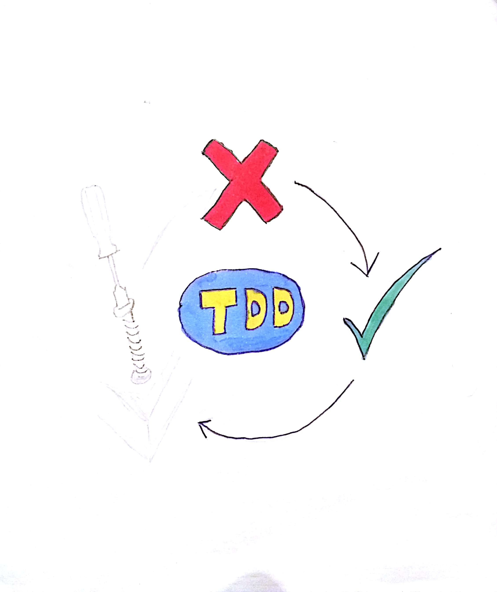
Note: Then we write some code to make the test green. It might be the most tautological solution you can think of. But it fullfills the requirement. 

??VERTICAL
### ceasars-cipher.js
```javascript
class CeasarsCipher {
    static encode(shift, text) {
        return 'BCD'
    }
}
module.exports = CeasarsCipher 
```

Note: Here we just setup the class with a static method, returing the very same result we expected. The test turns green.

??VERTICAL
### Triangulation

Note: Of course this does not help us much. We need an algorithm that really does the encryption. So how can we force it to do what we want by test? Currently we have only this one test. It provides our production code a large variety of how to act. Currently our production code could also raise a database or connect to a server in the internet. We need to center its freedom to what we need it to do. Just similar to how triangulation in GPS is working.

??VERTICAL
### One Satellite

Note: If you receive only one Satellite, you might be somewhere in the wide circle that the signal of the satellite projects on the surface of earth. 

??VERTICAL
### Two Satellites

Note: If you receive two Satellites, both projected circles intersect in two points. Both might represent your position on earth.

??VERTICAL
### Three Satellites

Note: Only if you you receive three or more Satellites your position can be determined. 

So we need also further tests to determine the concrete behaviour of our production code. The more tests we write, the closer we get to the specification

??VERTICAL
### A second test
```javascript
const CeasarsCipher = require('ceasars-cipher.js')

describe('ceasars-cipher', () => {
    describe('encode', () => {
        it('should encode "ABC" to "BCD"', () => {
            expect(CeasarsCipher.encode(1, 'ABC')).toBe('BCD')
        })

        it('should encode "HELLOWORLD" to "IFMMPXPSME"', () => {
            expect(CeasarsCipher.encode(1, 'HELLOWORLD')).toBe('IFMMPXPSME')
        })
    })
}) 
```

??VERTICAL
### Red-Green-Cycle III
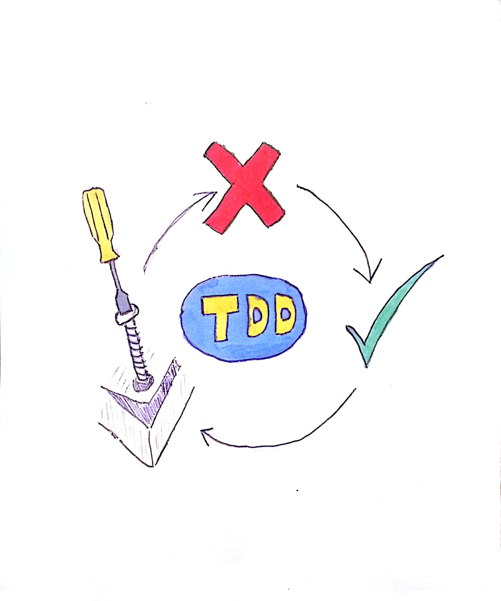
Note: So this brings us to the last step of the Red-Green-Cycle: Refactoring. After we somehow turned the tests to green with whatsoever ugly code we could and have to refactor code, to simplify it and assure that we will understand it again a month later wenn we will have to add another feature.

??VERTICAL
### A far better solution
```JavaScript
class CeasarsCipher {
    static encode(shift, text) {
        let result = "";
        for (let i = 0; i < text.length; i++) {
            result += String.fromCharCode(text.charCodeAt(i) + shift);
        }
        return result;
    }
}
module.exports = CeasarsCipher 
```

??VERTICAL
## Test more write less
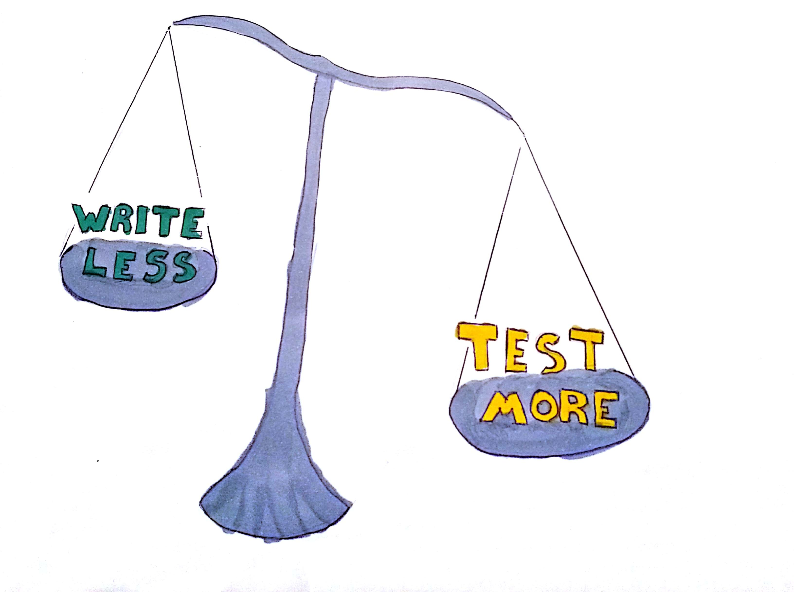
Note: So you see it makes sense to write as many tests as you need to describe the different git acceptanc criteria. But for each of these writing such complex tests is not what you want. Therefore we experimented with parametrised tests.

??VERTICAL
### Parametrised tests
```javascript
const CeasarsCipher = require('ceasars-cipher.js')

describe('ceasars-cipher', () => {
    describe('encode', () => {

        [
            { shift: 1, input: 'ABC', output: 'BCD' },
            { shift: 1, input: 'HELLOWORLD', output: 'IFMMPXPSME' },
            { shift: 1, input: 'XYZ', output: 'YZA'},
        ].forEach((setup) => {
            it(`should encode "${setup.input}" to "${setup.output}"`, () => {
                expect(CeasarsCipher.encode(setup.shift, setup.input))
                    .toBe(setup.output)
            })
        })
    })
    }) 
```
Note: Instead of writing for each test an it-block, we created parameter objects, that get fed into the foreach-loop. Inside of the forEach-loop, we used one of the two tests we wrote before and refactored it by replacing the hardcoded values by the parameters we passed in. With that technique you can test a lot of scenarios quite fast without loosing anything of the expressiveness of the tests itself. Afterwards you will simply be able to identify which test might have failed. Unfortunatelly, this makes it harder to enforce specific tests with fit or disable tests with xit.
Please recognize that I also added a test to check if the algorithm works if the shift spreads accross the boarder of the alphabet. This should fail, since the ascii table provides far more chars than the 26 of the alphabet.

??VERTICAL
### More Refactoring
```JavaScript
const _alphabet = createIndexForUnchangedChars(['A', 'B', ... 'Y', 'Z'])

function toAlphabetIndex (text) {
    return text.split('')
        .map((ch) => _alphabet.indexOf(ch) )
}

class CeasarsCipher {
    static encode(shift, message) {
        let key =  _alphabet
                .slice(shift)
                .concat(_alphabet.slice(0, shift))
        )
        return toAlphabetIndex(message.text).map((index) => {
                return key[index]
            }).join('')
        )
    }

```
Note: Therefore I refactored the algorithm. First I created an array containing the characters of the alphabet. From this I created the so called k, which is the new alphabet based on the expected shift operation. Now the encoding is a simple mapping between the normal alphabet and the key-alphabet.

??VERTICAL
### Property Based Testing
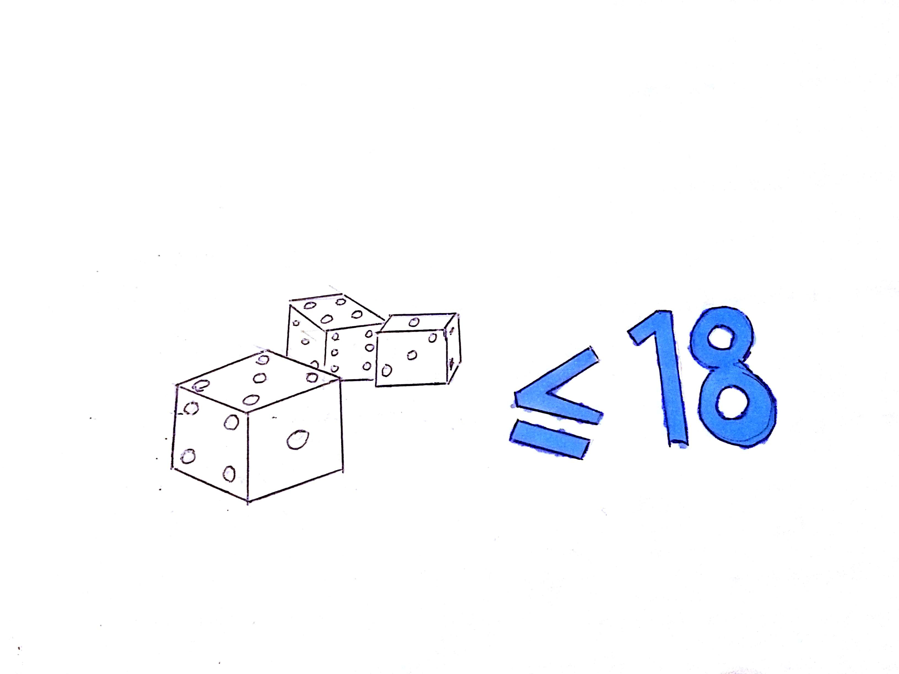
Note: But even now, we can not be sure, to think of all variants that could happen to our method. Any ideas what I might have missed until now?

Wouldn't it be great to let the computer think of all variants we might forget? This approach is called Property Based Testing. For this we have to think of a so called invariant, something that holds true no matter what kind of parameter we put in the method. One way to find this, is to have some kind of undo-function.

??VERTICAL
### Undoing encode is decode
```javascript
    class CeasarsCipher {
        static encode(shift, text) {
            ...
        }

        static decode(shift, text) {
            return CeasarsCipher.encode(_alphabet.length - shift ,text)
        }
    }
```
Note: So in our case, after we encoded a text, we also want to decode it. And the result of decode should be the very same text, that we before put into encode. 

??VERTICAL
## ceasars-cipher.pbt.js
```javascript
    const CeasarsCipher = require('./ceasars-cipher.js')
    const jsc = require('jsverify')

    describe('invariant', () =>  {
        it('should hold true for any parameter', () => {
            const outcome = jsc.checkForall(
                jsc.integer,
                jsc.string,
                (shift, text) => {
                    const encoded = CeasarsCipher.encode(shift, text)
                    const decoded = CeasarsCipher.decode(shift, encoded)
                    return text === decoded
                }
            )
            expect(outcome).toBe(true)
        })
    })
```
Note: For PropertyBasedTesting in JavaScript, we used JSVerify. Let's first have a look at how to use JSVerify. jsc comes with a function called checkForall. It takes an undefined number of parameters. All but the last parameter should be so called generators. jsverify provides a lot of them, even for datatypes that you would not expect in JavaScript, like integer. This generator will create random integer numbers that might range between minus infinity and inifinity. But it preferably tries to generate numbers around edgecases like zero. Similar is true for jsc.string.
Those generated values get passed to the callback, which is always the last parameter of checkForall. Here you see in code, our idea for the invariant. We take the text we get passed, encode it, decode the result and compare it with the text we originally got passed. If they are equal we return true or false otherwise.
Of course checkForall will not run for every value in the realm of possible values. Such a test would take far too long. Instead it calls the callback by default a 100 times.
The outcome-variable in our example should be true after all these evaluations. But be careful, otherwise it will become an object containing error information. SO YOU MUST NOT USE THE MATCHER toBeTruthy HERE, BECAUSE JAVASCRIPT WOULD RECOGNIZE EVEN SUCH AN ERROR OBJECT TO BE TRUTHY!

So Santa do you think this test just passed without any issues? No of course not - it showed me a lot flaws I did oversee in the first place:

??VERTICAL
### What JSVERIFY tells us
```javascript
{
    "counterexample": [0, "\u0000"],
    "counterexamplestr": "0; \"\\u0000\"",
    "shrinks": 12,
    "exc": false,
    "tests": 2,
    "rngState": "83df0385ec9672a1b4 "
}
```
Note: 
Here you see that my algorithm failed on the unified character \u0000. The reason for that was, that my algorithm had to limit the amount of supported characters to upper case chars A-Z and white spaces by depending on the Array with all supported chars.
We also see so called "shrinks" which are modifications of a random data that get reduced to the critical corner cases like empty strings or 0
rngState is the seed used for the randomized data. It helps you to reproduce an error case if it happens to you.

??VERTICAL
### What JSVERIFY tells us II
```javascript
{
    "counterexample": [27, "A"],
    "counterexamplestr": "27; \"A\"",
    "shrinks": 5,
    "exc": false,
    "tests": 11,
    "rngState": "09b2da8c1e9530f764"
}
```
Note: And the other issue I missed was that the shift has to be limited to 26 because of the length of the used alphabet array. 

??VERTICAL
### A solution to the issues
```JavaScript
    static encode(shift, message) {
        if (shift < 0 || shift > 26) {
            throw new Error (`Only shifts between 0 and 26 are allowed: ${shift}`)
        }
        if (!(message instanceof Message)) {
            throw new TypeError(`"${message}" is no valid Message!`)
        }
        ...
    }
```
Note: Let's fix it by clearifing in which range of values the algorithm is properly defined.

??VERTICAL
### Adopted invariant test
```javascript
    const CeasarsCipher = require('./ceasars-cipher.js')
    const jsc = require('jsverify')

    describe('invariant', () =>  {
        it('should hold true for any parameter', () => {
            const outcome = jsc.checkForall(
                jsc.nat(26), //only positive values up to 26
                jsc.sothat(jsc.asciistring, (text) => {
                    return text.match(/^[A-Z]*$/)
                },
                (shift, text) => {
                    const encoded = CeasarsCipher.encode(shift, text)
                    const decoded = CeasarsCipher.decode(shift, encoded)
                    return text === decoded
                }
            )
            expect(outcome).toBe(true)
        })
    })
```
Note: Now that it is clearly defined in which value range the algorithm works as expected, it is also ok, to shrink the range of values in the pbt. 

??VERTICAL
### BUT... 
* it is not appicable for every algorithm <!-- .element: class="fragment" -->
* it works best for revertable operations <!-- .element: class="fragment" -->
* it works for idempotent results <!-- .element: class="fragment" -->

Note: So you see, it is extremly helpful, to test your methods with property based testing. BUT it is not applicable to every algorithm. It works best for operations, that are revertable or that produce invariant idempodent results. If you are not working in pure functional environment, you probably need to plug different classes and services together so how can you properly test this issues.

??VERTICAL
## Interaction with other units
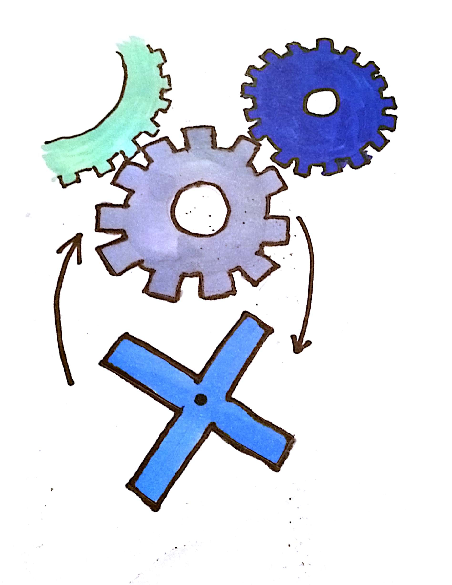
Note: Santa do you see that we have use cases that can not be tested with pbt? As soon, as your unit needs support from other units, you need another form of testing. Now let's consider how you can access other units?

??VERTICAL
### What we want to test for
```JavaScript
const logger = require('./logger')
class CeasasCipher
    static encode(shift, message) {
        if (shift < 0 || shift > 26) {
            const msg = `"${shift}" is no valid shift parameter!`
            logger.error(msg)
            throw new TypeError(msg)
        }
        ...
    }
    ...
}

```
Note: Let's say our ceasar-cipher-class needs to write to a logger when somebody failed in passing a correct message object to the encode-method. The logger might do whatever in that call like writing the info to a database, doing a console.log or turn the alert lights in your headquater to red. This is a side effect. This is nothing, we can check by exploring the output of a method. And it must not be of any concerns for ceasars-cipher what exactly logger does here. It is just important, that the right method of logger got called.

??VERTICAL
### Monkey Patching
```JavaScript

const obj = {
    foo: () => {
        console.log('foo')
    }
}

obj.foo() // foo

const origFoo = obj.foo
obj.foo = () => {
    origFoo()
    console.log('bar')
}

obj.foo() //foo bar


```
Note: This is the first occation where we need something called mocking. To explain how mocking works in most testing and mocking frameworks, we need to explain what monkey patching is.
In JavaScript functions are first class citizens, so you can pass them around like numbers, strings or any other kind of value. In addition members on objects are usually not writeprotected. Therefore you can simply modify the behaviour of an objects method by overwriting it with another function. Usually this is called Monkey Patching.

If you protect the original functionality of that method and just augment it by additional code, this is called AspectOrientedProgramming and is more or less what happens when you apply annotations in TypeScript or any other kind of language.

So you might say, this is a pretty feature of the language. But if you can not easily recognize this from the source, this can lead to extremely hard to find bugs. Therefore monkey patching is frowned on and you will not see it in the wild but when a compiler secures its application like in Angular / TypeScript.

??VERTICAL
### Accessing other units
```JavaScript
const CeasarsCipher = require('./ceasars-cipher')

jest.mock('./logger')
const logger = require('./logger')

describe('CeasarsCipher', () => {
    describe('encode', () => {
        it('should call logger on wrong shift value', () => {
            const corruptShift = 27
            expect(() => { 
                CeasarsCipher.encode(corruptShift, 'ABC')
            }).toThrow()
            expect(logger.error).toHaveBeenCalled()
        })
    })
})
```
Note: Mocking depends very much on the testing framework or the mocking api you use (jasmine, jest, sinon, testdouble). Each provides its opinionated api to create mocks. What you choose is a matter of taste and a question weather or not you can or want to change your framework. But in any case under the hood happens more or less what I described as MonkeyPatching.Since I described all examples until now with jest, we will have a look at the jest api for mocking. 

In JavaScript all Modules act by default like a singleton. This allows us to manipulate the very same instance of logger in the test, that is also used in the production code. So jest.mock overwrites require, analyses which methods are part of logger module and replaces each of them by jest.fn mock functions (also called spies) which calls get tracked by test.
So after provoking an error in the method and checking that this throws an exception, we can also check if logger.error have been called by the toHaveBeenCalled-Matcher.


??VERTICAL
### ceasars-cipher.js
```JavaScript
const Logger = require('./logger')

class CeasarsCipher {
    constructor() {
        this.logger = new Logger();
    }

    encode(shift, message) {
        if (shift < 0 || shift > 26) {
            const msg = `"${shift}" is no valid shift parameter!`
            this.logger.error(msg)
            throw new TypeError(msg)
        }
        ...
    }
    ...
}
```

Note: But lets say, logger would not be used as a singleton. Instead it would get generated dynamically in ceasars-cipher class itself. 

* First of all this would mean to turn our nice static methods into state tainted methods.

??VERTICAL
### ceasars-cipher.spec.js
```JavaScript
const CeasarsCipher = require('./ceasars-cipher')
const Logger = require('./logger')

describe('CeasarsCipher', () => {
    describe('encode', () => {
        let mockError, ceasarsCipher
        beforeEach(() => {
            mockError = jest.spyOn(Logger.prototype, 'error')
            mockError.mockImplementation(() => {})
            ceasarsCipher = new CeasarsCipher()
        })

        afterEach(() => {
            mockError.mockRestore()
        })
        it('should call logger on wrong shift value', () => {
            const corruptShift = 27
            expect(() => { 
                CeasarsCipher.encode(corruptShift, 'ABC')
            }).toThrow()
            expect(Logger.prototype.error).toHaveBeenCalled()
        })
    })
})
```
Note: The Test-Setup complicates a lot:
* First we have to answer the question, how to access the Logger.error method, that needs to be mocked? You might want to access the logger variable of the instance. But it is it a good idea to access a member that is ment to be private ...? Does this tell the reader anything? The private variable logger might also be just a console.log instance or what ever. So we have no proof, that this call really means triggering a sideeffect.
You can also overwrite the error-method on the prototype. But if you have more instances of logger, this can get tricky since you need to
define how error should act according the instance it is running on in one implementation.
* Second you have to manually undo the mocking (as seen in the afterEach-block) which somebody might forget to do, that can lead to strage behavious in other tests.

??VERTICAL
### BUT ...
* mocking dynamic objects is complex <!-- .element: class="fragment" -->
* overwriting require leads to hard bug anlysis <!-- .element: class="fragment" -->
* codesmell due to hardcoded dependencies <!-- .element: class="fragment" -->

Note:
As you can see mocking dynamically created objects, get more complex.
-> Overwriting require as jest.mock does can lead to bugs that are hard to find. My experience with similar tools like testdouble or proxyquire introduced me often to errors I could not resolve. Therefore I want to discourage this kind of mocking
-> In addition, this kind of mocking comes with a code smell. It means that you hardcoded a dependency. You miss an opportunity to apply the open closed principle by that. Otherwise you could modify the behaviour of this class just by passing in another dependency that provides similar functionality.

??VERTICAL
### ceasars-cipher.js
```JavaScript
class CeasarsCipher {
    constructor({ logger }) {
        this.logger = logger;
    }

    encode(shift, message) {
        if (shift < 0 || shift > 26) {
            const msg = `"${shift}" is no valid shift parameter!`
            this.logger.error(msg)
            throw new TypeError(msg)
        }
        ...
    }
    ...
}
```

Note: So if we would inject the logger dependency via constructor, it would look like this. Please recognize that we now do not have to require logger anymore. It is sufficiant to pass it to constructor. 
Here we used deconstruction defined since ES6. It means that you put in an object literal that contains a field logger. And its content gets automatically mapped to a local variable called logger.


??VERTICAL
### ceasars-cipher.spec.js
```JavaScript
const CeasarsCipher = require('./ceasars-cipher')

describe('CeasarsCipher', () => {
    describe('encode', () => {
        let logger, ceasarsCipher
        beforeEach(() => {
            logger = {
                error: jest.fn()
            }
            ceasarsCipher = new CeasarsCipher({ logger })
        })

        it('should call logger on wrong shift value', () => {
            const corruptShift = 27
            expect(() => { 
                CeasarsCipher.encode(corruptShift, 'ABC')
            }).toThrow()
            expect(logger.error).toHaveBeenCalled()
        })
    })
})
```
Note: Now we have full controll over the testsetup. We do not need to clean up the mock, because it gets rebuild for each test. The tests do no longer depend on Logger module or the path to it, which means we are free to move ceasars-cipher.js and ceasars-cipher.spec.js whereever we want. This test is far more resillient since it only breaks if its own code breaks. 


??VERTICAL
### app.js
```JavaScript
const CeasarsCipher = require('./ceasars-cipher')
const logger = require('./logger')

const ceasarsCipher = new CeasarsCipher(logger)
console.log(ceasarsCipher.encode(1, process.argv[2]))
```
Note: But now that each of our modules work independently how should we run the complete Program? We need now something that wires all the modules together. In this case I called it app.js but you will find similar files like server.js in your application. They are what in a classic C Programm was the main-method. It wraps up the start point for the complete application.
This part of the application can not or only with much effort be tested by unit tests. So we do not automatically test it. But this code should be as thin as possible.

I think you see that for this very simple use case, it is completely ok to do the wiring manually. But I think you can estimate, that very soon this wireing will get far to complicated and error prone.

??VERTICAL
### Automatic Dependency Injection
```JavaScript
const { createContainer, asClass } = require('awilix')

const container = createContainer()

container.register({
    ceasarsCipher: asClass(require('./ceasars-cipher')),
    logger: asClass(require('./logger'))
})

const ceasarsCipher = container.resolve('ceasarsCipher')
console.log(ceasarsCipher.encode(1, process.argv[2]))
```
Note: That is the reason why we should use a Dependency Injection Framework like awilix for JavaScript. Since we do not have valid type information in JavaScript, DI can not validly depend on it like it does in Java or Angular/Typescript. It has two Injection Modes:
* By Proxy: This the default option and it expects the constructor of your classes to take a parameter object that contains the dependencies. Depending on the names used in this parameter objects, it identifies which Dependencies to build and inject.
* CLASSIC: This works the same way as DI worked in Angular1. The parameternames of a constructor get analysed and used to identify dependencies. The Problem with this approach is, that you can not minify the code, since the variable and parameter names will be renamed in that process. 
So here we create a DI-Container and register relevant classes or if you are familiar with functional programming, which I really recommend to you for JavaScript, you can also register Functions or plain values to it.
container.resolve will instantiate a CeasarsCipher-Object for us with the necessary dependencies and that we can call as before.

This is what I want to reach Santa. If we have this deep level and quality of UnitTesting everywhere, we really only need one or two E2E-Tests to check the happy path. Or we might even omit them and test manually since the only thing that should break now is the configuration.

??VERTICAL
## Did I do enough tests?

Note: In the beginning of this talk, I described the situation that we need to take care to prevent the broken window syndrome and we need trust in our test? So until now I showed you a lot of testing techniques and if you apply them, I suppose you will get a lot of good tests. But how can you get trust? Let's say you apply those techniques but your collegues are not so strict. This would mean, your code is properly tested but the rest of the application is not tested properly. This would mean that your team would loose confidence into the outcome of the test. So we need some kinds of quality measures to assure our trust.

??VERTICAL
### CodeCoverage

Note: One option to gain that trust is Code Coverage. The basic idea is, that each line in your Code gets instrumentalized, so that meanwhile test we can track which line of code has been passed. The standard Code Coverage tool for JavaScript is Istanbul. In many cases it is already installed. If you setup your Angular Project for example with Angular-cli or if you work with react and you use Jest for your tests it is also already part of the installation. Let's have a look what code coverage data looks like: 

??VERTICAL
### Console output
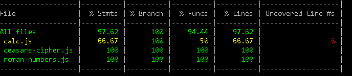
Note: Here we see the short coverage report for all tested files. It shows three diffrent columns:
* The Statements-Column displays the proportion of all executed Statements compared to the whole of statements.
* The Branches-Column means the same for all if and else statements in your code.
* Similar is true Functions-Column and the Lines-Column

So besides our already known ceasar-ciphers, we see also the file calc.js which seems to have some trouble. 

??VERTICAL
### calc.js
```JavaScript
module.exports = {
    add : function (a, b) {
        return a + b
    },
    sub : function (a, b) {
        return a - b
    }
}
```
Note: So calc is just a little dummy module with only two methods, add and sub. And where is the problem?

??VERTICAL
### calc.spec.js
```JavaScript
const calc = require('./calc.js')
describe('calc', function () {
    describe('add', function () {
        it('should add two numbers', function () {
            expect(calc.add(2,3)).toBe(5)
        })
    })
})
```
Note: The Problem is, that we are missing any test for sub. How would Istanbul have showed that to us?

??VERTICAL
### coverage report for calc.js
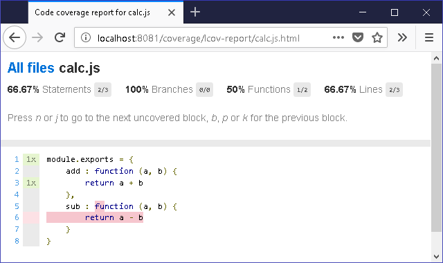
Note: Exactly that: The code of the method sub has never been called.

So far so good. If you work with a decent elve, she or he would write at least one test for sub and we are done. But sometimes this efford seems to be too much for my fellow elves. So Evil Elfe could think of this:

??VERTICAL
### cheat on coverage in calc.js
```JavaScript
module.exports = {
    add : function (a, b) { ... },
    
    sub : function (a, b) { ... },
    massivlyCheatCodeCoverage: function () {
        let i = 0
        i++
        i++
        i++
        ...
        i++
        i++
        i++
        return true;
    }
}
```
Note: A very long dummy method...

??VERTICAL
### cheat on code coverage calc.spec.js
```JavaScript
const calc = require('./calc.js')
describe('calc', function () {
    describe('add', function () { ... })
    it('should increase code coverage', () => {
        const result = calc.massivlyCheatCodeCoverage();
        expect(result).toBeTruthy();
    })
})
```
Note: ... and a meaningless test can trick code coverage very simple:

??VERTICAL
### Result on cheating code coverage
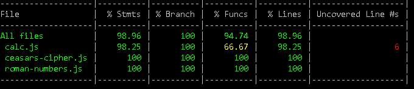

Note: Now Statements and Lines have a coverage of about 98%. I think in a more complex example you are very likly to overlook this issue and again have a hole in your window of trust.

??VERTICAL
## Mutation based Testing
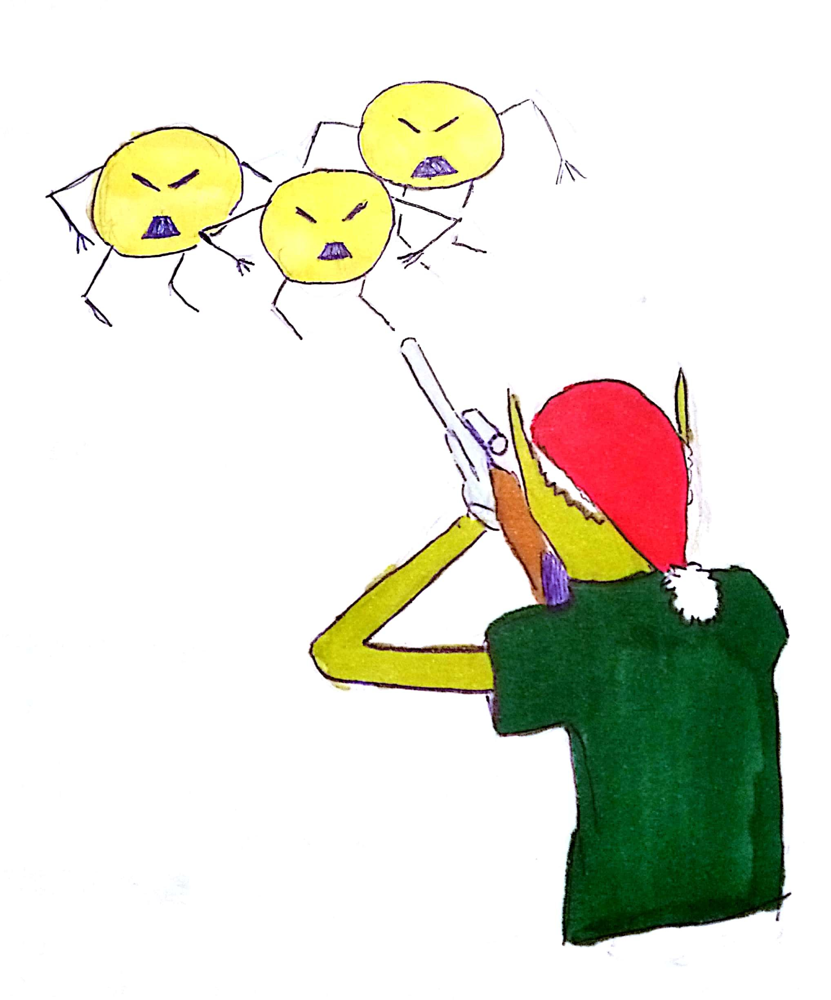
Note: A better option would be to work with mutation based testing. For JavaScript we use Stryker here. Instead of instrumenting your code it generates Mutants from it. This means it can replace + with - for example, or rename variables and many more. 
When Stryker runs it trys to kill each of the Mutants by running your test suite. And it might fail one or more Mutants, if you did not test for this specific issue.
In a configuration file, you can also decide which of those 30 Mutants must not be applied, if you think this aspect needs no attention.

??VERTICAL
### Stryker installation

Note: Installing Stryker is fairly simple. After installing it with npm you run it with the command init. This allows you to specify the testframework, testrunnr and the genrated reports. 

??VERTICAL
### Stryker run
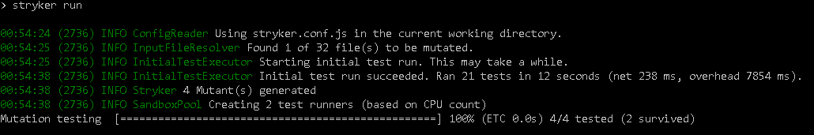
Note: In our example of calc, we see that Stryker
* initially runs the tests
* generates Mutants
* reruns the tests to kill them

??VERTICAL
### Stryker output
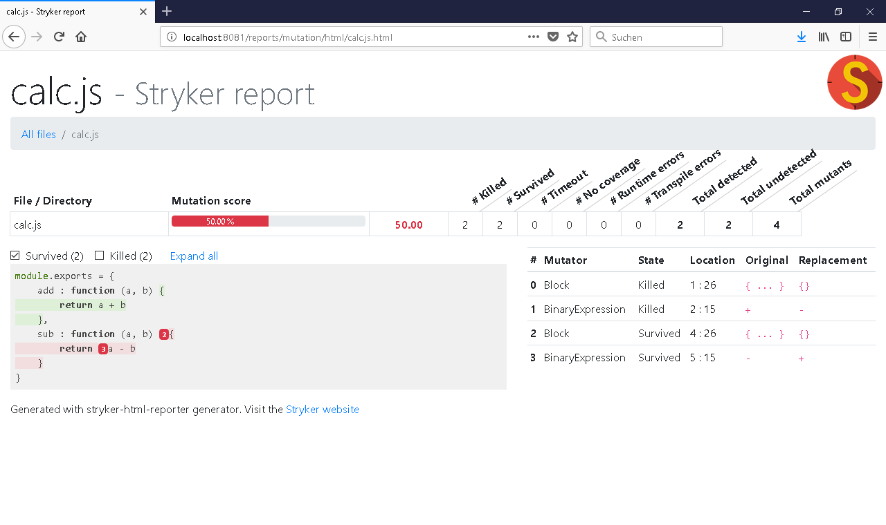

Note: We can see here a very similar output like for code coverage. But it can not be tricked. The only drawback would be, that it takes more time to run since it has to run the test suite for each mutant one time. So maybe it should only be done on build server.

??VERTICAL
## Summary
* use TDD <!-- .element: class="fragment" -->
* use PBT <!-- .element: class="fragment" -->
* use depdency injection <!-- .element: class="fragment" -->
* use Mutation based testing <!-- .element: class="fragment" -->

??VERTICAL
