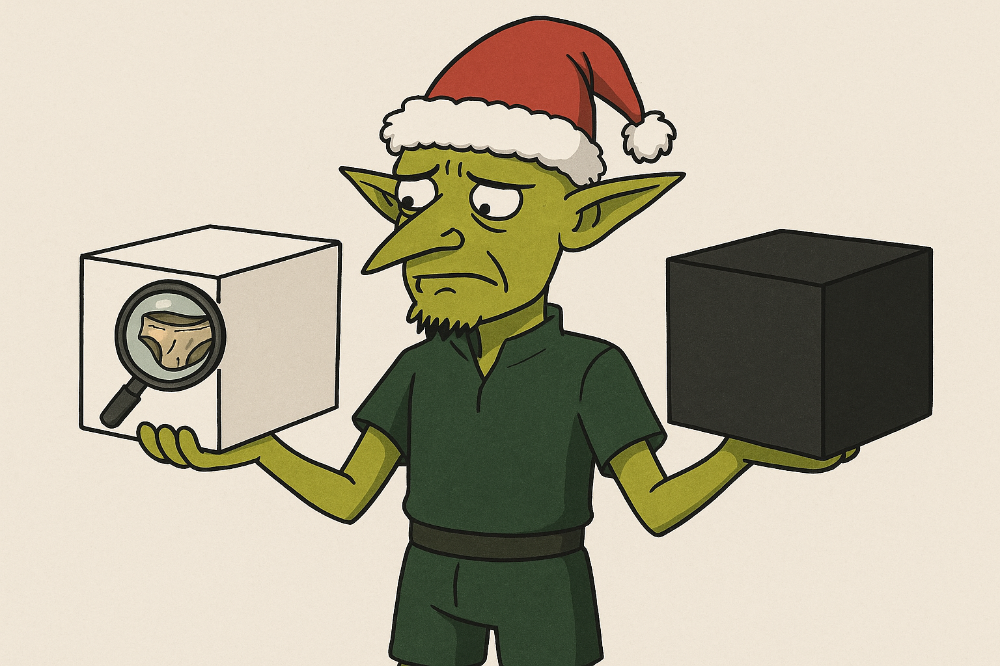
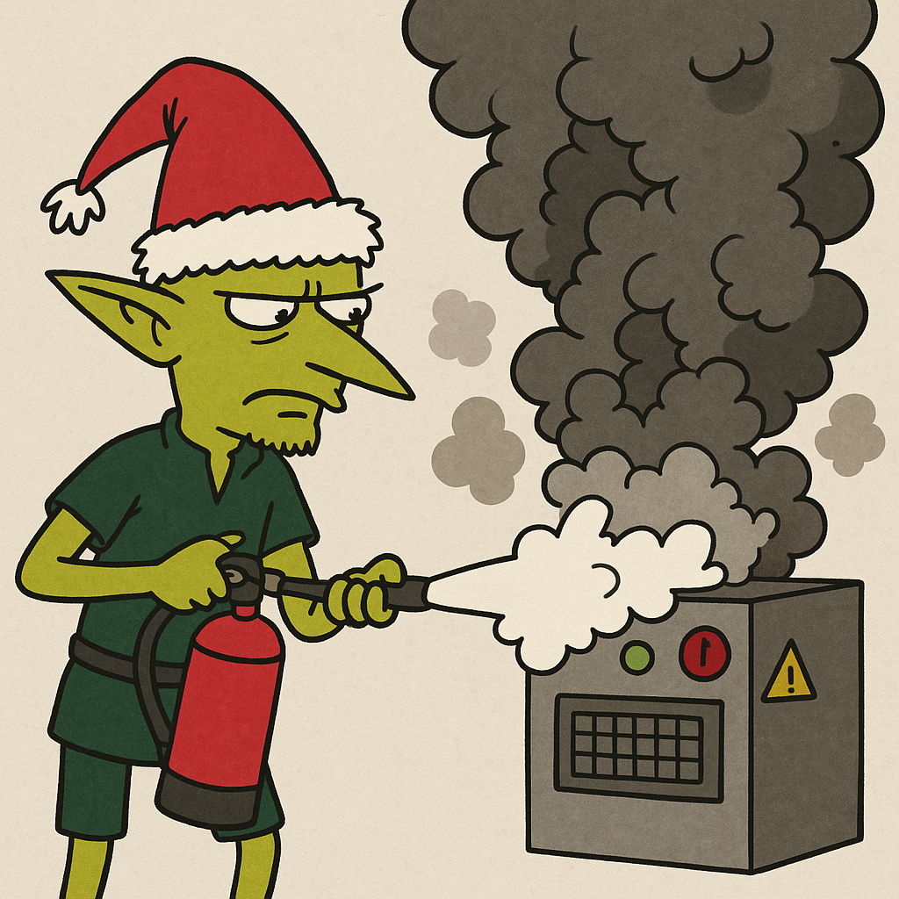

## Testing Strategies 
## (not only) 
## for JavaScript
by Christian H&ouml;rauf 

??HORIZONTAL

Note: Hi all, thanx for having me here. My name is Christian Hörauf and I work as a developer for Consorsbank in Nürnberg. Last year I gave Santa Clause for the children of our friends. And you know St Clauses Business. Providing pesents for children. But his unique selling point is this incredibly tough time schedule to visit all children in one night. You know this event, when everybody sets up Trees in their rooms and meets their families and stuff - X-Mess. And in that same night when I played St Clause, I had the dream that lead elves of computer game develoment was talking to me. And this is what he said:

Hey Santa, we need to talk about our flow of production. I understand that for you it is most important that we create presents, presents, presents. But I you know, that we do not have the progress you expected and maybe we can invest a little bit more time in our development process. I would love to provide you some ideas: 

??HORIZONTAL
## Motivation

Note: First of all, can you remember last year, when we were so far behind the schedule, that you was afraid that you could not deliver all ordered presents in time and people might loose faith in you? May I remind you of your awful nightmares you had at that time. You woke up every night and mumbled something about Easter Bunnies ruling the earth...
Can you remember the hussles we had back then? 

??HORIZONTAL
### No Trust in our quality measures

Note: We had no trust in our measures. When we saw an error, it did not matter.

??HORIZONTAL
### When something happened each elve tried to accuse some other elve

Note: Instead we prefered to accuse everybody else that they introduced the error.

??HORIZONTAL
### Since no one was accusable, nobody cared

Note: But very soon, who ever was interested in good quality gave up on it, because any quality measure they took, very soon had been turned of by others who did not trust in the quality measure and turned them of, just to assure the release date and not beeing "slowed down". 

??HORIZONTAL
### People send back presents

Note: But they ignored the fact, that they would loose much more time when people send back their presents due to some failures and they need to fix them.

??HORIZONTAL
### Broken-Window-Theory

Note: 
Did you ever heard of the Broken-Window-Theory? It predicts that if you do not care about all windows in a house and one is broken, soon somebody will say: Nobody takes care of it, so why not try to hit another window just for fun. I will not be accused anyhow.
And this was exactly what happened to our quality measures. 

??HORIZONTAL
### Testing decay

* If you do not trust in them, you do not take care of them <!-- .element: class="fragment" -->
* If you do not take care of them, they will become worthless <!-- .element: class="fragment" -->
* And you will be left with a bulk of unmaintainable code, as always... <!-- .element: class="fragment" -->

??HORIZONTAL
### Black- vs Whitebox Testing

Note: As a special interest request, we need to introduce the Terms Black- and whitebox Testing. Blackbox testing is it, when you don't know what is inside it and only can
see its outer appearance (Let's call it "interface".) And there are Whitebox-tests, where you know the internals of the box (like here, where you know there is dirty underware inside the box), which allows you to test it more deeply and with more detail. What do you think could be advantages vs disadvantages for both methodologies?

??HORIZONTAL
### Smoketests

Note: Another speciel interest request was the whish to introduce so called smoke tests. Those are used as a very simple form of test just to realize that a system still works after a deplyoment.

??HORIZONTAL
### Testing Pyramid

Note: Do you remember that we than took advice from this IT-Guy - Martin Fowler? He put up the model of the test pyramid. Since it is easiest and cheapest to write Unittests, he claims that you should create your test harness by a solid foundation of unit tests. Test the interaction of multiple Systems by some integration tests and only the happy path of the application by a few End-to-End-Tests. 

??HORIZONTAL
## TDD

Note: Back then we wondered how we could come to this solid foundation of unit tests. Is there some guidance that leads you to this solid foundation of unit tests? What is the easiest way to reach it? 

Do you remember that we applied Test-Driven-Development to reach this state? Yes it was hard time to convice my co elves to learn and apply this technique. I had to explain them how we spend our days without TDD and how it changed like Michael Hill explained it.

??HORIZONTAL
### Programm (classic)

Note: When you write Software, of course you spent some time programming. This is the best part of the day when you can be creative and think about what the Software might need and you acutally write code.

??HORIZONTAL
### Study (classic)

Note: But you also have to study code, to find the right place where to introduce features and find out how the system concretely works.

??HORIZONTAL
### Geek at Keyboard (classic)

Note: But the majority of time we spent stepping through code by debugging. We debug to find out how the software currently works. We debug to test if our code changes work properly maybe several times. We click dozens of times through our app to bring the app into the state where the bug has to be fixed or the feature has to be implemented. This is such a waste of time.

Let's have a look how this time spending changed after we applied TDD

??HORIZONTAL
### Programm (TDD)

Note: So one of the issues the other elves had became true: Yes we spent about double of time for Programming (from which I said it is the best part of the day), because besides the production code we also have to write tests. BUT ...

??HORIZONTAL
### Studying (TDD)

Note: Already the studying took less time, since for every production file we created also a test file which contains examples of each method how to use it and what outcome its call will have. So you will be much faster in studying because of the evaluatable documentation you have at hand.

??HORIZONTAL
### Geek at Keyboard (TDD)

Note: But especially the GaK-Time reduced by 60-80%, because there was no need anymore to debug. There was no need to manually setup environments. All these things get prepared in for the tests upfront by mocking and stubbing.

??HORIZONTAL
### Red-Green-Cycle I

Note: So the basic idea behind TDD is, that we first write a test (not some tests, only one test), that describes one of the acceptence criteria for the feature we want to implement. So this very beginning makes us thinking:

??HORIZONTAL
### Design Decisions    
* How should we name it? <!-- .element: class="fragment" -->
* Where should we place it? <!-- .element: class="fragment" -->
* What would we expect from it? <!-- .element: class="fragment" -->

Note: This already brings us into the need to make design decisions.
